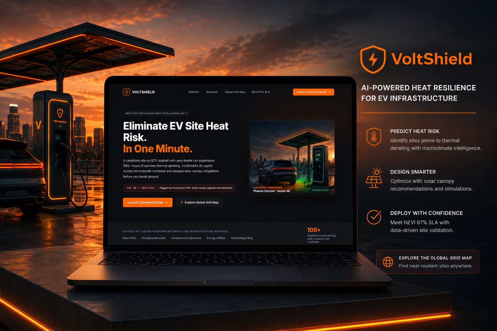
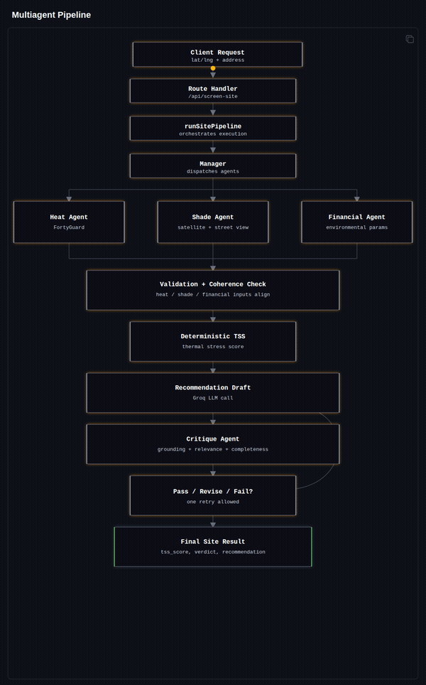
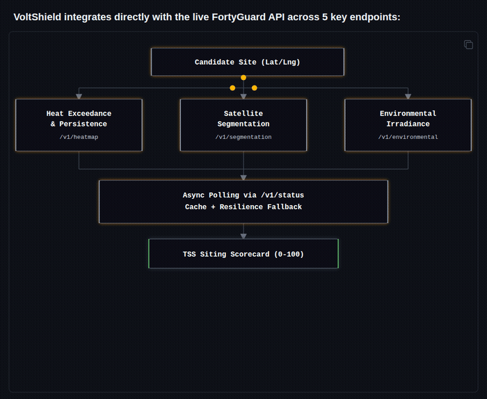

# 🛡️ VoltShield — Climate-Resilient EV Siting Copilot

<p align="center">
  
</p>

**Official Submission for the FortyGuard Urban Heat Hackathon 2026**

[](https://voltshield-sw7k.onrender.com)
[](https://api.fortyguard.com)
[](https://groq.com)
[-blue.svg)](https://sqlite.org)
[](https://reactjs.org)
[](https://nodejs.org)
[](https://www.fhwa.dot.gov/environment/alternative_fuel_corridors/resources/nevi_program/)

🚀 **Live Web Application:** [https://voltshield-sw7k.onrender.com](https://voltshield-sw7k.onrender.com)

> **Eliminate EV site heat risk before you break ground.** VoltShield pairs **FortyGuard 10-meter urban heat intelligence** with autonomous multi-agent AI to predict localized EV charger overheating, quantify curtailed revenue losses, and simulate physical mitigations (solar canopies, high-albedo sealcoats) that guarantee federal **NEVI 97% uptime compliance**.

---

## ⚡ The Problem: The Invisible Climate Threat to EV Charging

The National Electric Vehicle Infrastructure (NEVI) program allocates $5 Billion to deploy fast-charging corridors across the United States. Federal regulations (**23 CFR Part 680**) mandate a strict **97% uptime requirement** to qualify for 80% federal grant matching.

However, DC fast chargers (150kW to 350kW) face a silent, catastrophic operational hurdle:
1. **Thermal Derating:** When ambient air hits **35°C (95°F)**, charger power electronics and charging cables automatically throttle output current by up to **50%** to prevent component meltdown.
2. **The Asphalt Heat Battery:** Charging hubs are built on 90%+ dark asphalt parking lots with low albedo (0.05). Under summer sun, the asphalt absorbs solar radiation and creates localized microclimate heat bubbles **8°F to 15°F hotter** than regional weather forecasts.
3. **The Consequence:** Vehicle dwell times double, charging operators lose **$12,000+ per site/year** in curtailed power throughput, and thermal shutdowns violate the NEVI 97% uptime mandate, triggering catastrophic federal grant clawbacks.

**Regional airport weather stations cannot detect this—because heat is hyperlocal.** VoltShield bridges this gap with FortyGuard's 10-meter temperature model.

---

## 🌟 Core System Features

```
VoltShield/
├── frontend/   Single-Port React 18 + Vite SPA (:5173)
│   ├── Landing Page (Photo hero, before/after thermal evidence, 1-click launch)
│   └── 11-Screen Enterprise Command Center (Portfolio, Grid Map, Wizard, Sandbox, Mitigation Canvas, NEVI Report)
│
└── backend/    Node.js Express API + SQLite (voltherm.db) (:4000)
    ├── Multi-Agent Intelligence (Heat, Shade, Financial, Manager, Critique Fact-Checker)
    ├── FortyGuard Live API Integration (10m LTM heat, satellite segmentation, environmental irradiance)
    └── Groq LLM AI Copilot (Real-time engineering reasoning grounded in parcel telemetry)
```

### 1. FortyGuard 10m Hyperlocal Urban Heat Intelligence
* Direct integration with `https://api.fortyguard.com` querying 10-meter resolution temperature exceedance ($>35^\circ\text{C}$), heat persistence streaks, satellite canopy segmentation, and solar irradiance.

### 2. Defensible Thermal Siting Score (TSS 0–100)
* A deterministic mathematical scorecard ranking candidate parcels into:
  * **Critical Risk (TSS < 50):** High derating frequency, urgent mitigation required.
  * **Medium Risk (TSS 50–74):** Moderate thermal stress, monitor or partial canopy.
  * **Optimal (TSS ≥ 75):** High natural shade, low heat retention, compliant.

### 3. Autonomous Multi-Agent Verification Pipeline
* **Heat Agent:** Queries FortyGuard 10m LTM for annual hours exceeding 35°C.
* **Shade Agent:** Segments satellite imagery for tree canopy deficit and surface pavement.
* **Financial Agent:** Computes curtailed power losses ($/yr) based on local utility tariffs and charging dwell times.
* **Manager Agent:** Synthesizes metrics, computes deterministic TSS, and drafts engineering recommendations via Groq LLM.
* **Critique Agent:** Automated fact-checker running 4 validation tests (Numeric Consistency, Fact Grounding, Relevance, Completeness) with bounded revision loops.

<p align="center">
  
</p>

### 4. Interactive Mitigation Design Canvas
* Live geospatial Leaflet canvas centered on the parking parcel.
* Real-time toggles for **Bifacial Solar Canopies** and **High-Albedo Reflective Sealcoats**.
* Instant recalculation of mitigated TSS (**+24 to +46 pts**), internal cabinet cooling (**-12°F**), and **1.7-year CAPEX payback**.

### 5. Federal NEVI 97% SLA Compliance Certification
* One-click generation of a formal white-paper audit report with GIS satellite parcel snapshots, avoided downtime calculations, and a **Professional Engineer (PE) certification seal** ready for state DOT grant awards.

---

## 🌐 FortyGuard API Usage & Integration

VoltShield integrates directly with the live FortyGuard API across 5 key endpoints:

<p align="center">
  
</p>

| Analytical Endpoint | Agent | Purpose & Payload | Extracted Metrics |
| :--- | :--- | :--- | :--- |
| `POST /v1/heatmap` (exceedance) | `heatAgent` | Parcel polygon AOI, `threshold: 35` | `exceedance_hours_per_day` above 35°C |
| `POST /v1/heatmap` (persistence) | `heatAgent` | Parcel polygon AOI, `analytic_type: "persistence"` | `persistence_max_hours` continuous heat trap |
| `POST /v1/segmentation/satellite` | `shadeAgent` | Parcel bounding box | `canopy_pct`, `pavement_pct`, `building_pct` |
| `POST /v1/segmentation/street-view` | `shadeAgent` | GPS coordinate point | `ground_level_shade_pct` (tree canopy) |
| `POST /v1/environmental` | `financialAgent` | GPS coordinate point | `ghi` solar irradiance ($W/m^2$), `wet_bulb_c` |
| `GET /v1/status/{activity_id}` | Client | Asynchronous status polling loop | Status `Completed` / `Failed` with result object |

* **Resilience Strategy:** FortyGuard responses are cached in memory for 1 hour (`CACHE_TTL_MS = 3600000`). If FortyGuard services experience network timeouts, VoltShield serves stale cache data up to 24 hours old with high confidence flags, ensuring zero dashboard downtime.

---

## 🖥️ Screen-by-Screen Walkthrough

| Screen | Route | Description |
| :--- | :--- | :--- |
| **Marketing Landing Page** | `/` | Photo hero banner (`hero-charging-station.jpg`), trust bar, before/after thermal satellite photos (`site-risk-before.jpg` & `site-mitigated-after.jpg`), 6-pillar feature grid, and direct 1-click launch. |
| **Siting Portfolio** | `/portfolio` | Executive dashboard ranking candidate sites across the US with TSS score progress bars, risk filters (All, Critical, Medium, Optimal), and annual revenue loss metrics. |
| **US Grid Map** | `/grid` | Geospatial Leaflet map locked strictly to the United States (FortyGuard CONUS coverage) with animated pulsing pins, satellite aerial toggle, and direct sandbox navigation. |
| **3-Step Setup Wizard** | `/wizard` | Interactive site evaluation tool: drop a pin on any lot, select charger power (150kW–350kW), toggle liquid vs. air cooling, input local utility tariffs, and watch live TSS stress preview. |
| **Radar Scan Loader** | `/loader` | Animated 4-stage FortyGuard radar sweep verifying microclimate heat exceedance and auto-persisting the candidate site to the SQLite database. |
| **Siting Sandbox** | `/sandbox/:id` | Detailed parcel telemetry: 10m FortyGuard heatmap overlay, dispenser hardware statuses, SVG monthly throttling curves, **Site Switcher Dropdown**, and **Live Groq AI Copilot**. |
| **Mitigation Canvas** | `/editor/:id` | Geospatial parcel design tool: toggle bifacial solar canopies and high-albedo cool paints directly on satellite parking stalls. Live before/after TSS meter leap (`42` $\rightarrow$ `88`), dispenser telemetry drawer, and 1.7-year CAPEX payback estimator. |
| **NEVI Audit Report** | `/report/:id` | Formal white-paper engineering letterhead with GIS satellite snapshot, economic impact table, mitigation ROI specs, and Professional Engineer (PE) certification seal ready for state DOT grant awards. |

---

## 🚀 Quick Start Guide (Local Development)

### Prerequisites
* Node.js 18+

### 1. Clone & Install Dependencies
```bash
git clone https://github.com/farheenimam/Voltherm.git
cd Voltherm

# Install all dependencies (root, frontend, and backend)
npm run build
```

### 2. Configure Environment Variables
Create a `backend/.env` file with your credentials:
```ini
PORT=4000
NODE_ENV=development

# FortyGuard Heat Intelligence Keys
FORTYGUARD_BASE_URL=https://api.fortyguard.com
FORTYGUARD_API_KEY_HEAT=your_heat_key_here
FORTYGUARD_API_KEY_SHADE=your_shade_key_here
FORTYGUARD_API_KEY_FINANCIAL=your_financial_key_here

# Groq LLM Credentials
GROQ_API_KEY=your_groq_api_key_here
GROQ_MODEL=llama-3.3-70b-versatile
```

### 3. Start the Application
Open two terminal tabs:

```bash
# Terminal 1: Backend API & SQLite Database (:4000)
npm run backend

# Terminal 2: Unified Frontend (:5173)
npm run frontend
```

* **Live Web App (Production):** [https://voltshield-sw7k.onrender.com](https://voltshield-sw7k.onrender.com)
* **Backend API Health:** [https://voltshield-sw7k.onrender.com/api/health](https://voltshield-sw7k.onrender.com/api/health)
* **Localhost Development:** [http://localhost:5173/](http://localhost:5173/) (Backend on `:4000`)

---

## ☁️ Deployment

### 1-Click Deployment with Docker / Railway / Render
VoltShield includes a multi-stage production [`Dockerfile`](./Dockerfile). The backend is configured to automatically serve the built frontend (`frontend/dist`) under a single service:

* **Build Command:** `npm run build`
* **Start Command:** `npm start`
* **Port:** `4000` (serves both the API and the React Single Page Application on one URL with zero CORS issues).

---

## 📮 Postman API Collection

Import the included Postman Collection:
👉 **[`VoltShield_API.postman_collection.json`](./VoltShield_API.postman_collection.json)**

| Method | Endpoint | Description |
| :--- | :--- | :--- |
| `GET` | `/api/health` | Service liveness check |
| `GET` | `/api/sites` | List all sites & portfolio aggregates from SQLite |
| `GET` | `/api/sites/:id` | Fetch complete parcel telemetry & dispenser nodes |
| `POST` | `/api/sites` | Create a new candidate site from wizard inputs |
| `PUT` | `/api/sites/:id/mitigations` | Persist solar canopy and albedo mitigations to SQLite |
| `POST` | `/api/copilot/chat` | Ask VoltShield AI Copilot (Groq LLM with site context) |
| `POST` | `/api/screen-site` | Run 5-agent pipeline on GPS coordinates |
| `POST` | `/api/screen-sites` | Multi-site comparative portfolio audit |

---

## 👥 Team & License

Built with ❤️ for the **FortyGuard Urban Heat Hackathon 2026**.
Released under the MIT License.
